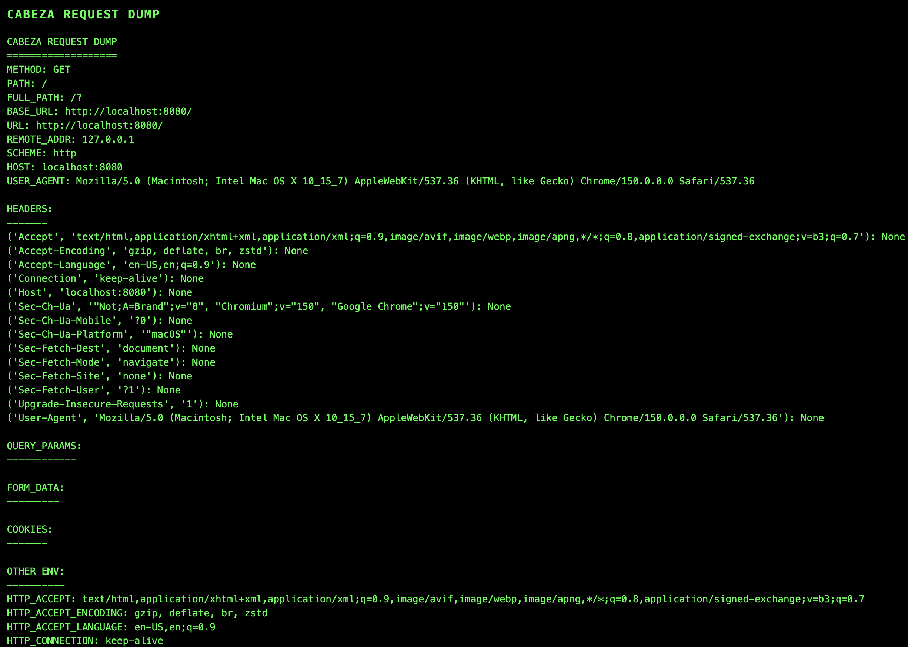

# cabeza

[](https://github.com/bgulla/cabeza/actions/workflows/docker.yml)
[](https://github.com/bgulla/cabeza/pkgs/container/cabeza)
[](https://github.com/bgulla/cabeza/pkgs/container/cabeza-chart)
[](LICENSE)

Dumps every HTTP header and request detail that reaches it. Useful for inspecting what a Kubernetes ingress, load balancer, or reverse proxy actually forwards to your pods.



## Helm

The chart is published to GHCR as an OCI artifact and is designed to run on Palantir Apollo / FedStart.

```bash
helm install cabeza oci://ghcr.io/bgulla/cabeza --version 1.0.0001 \
  --set baseURL=https://<your-domain>.palantirfedstart.com \
  --set domainAlias=DEFAULT
```

### Minimal Apollo overrides

```yaml
overrides:
  baseURL: "https://<your-domain>.palantirfedstart.com"
  domainAlias: "DEFAULT"
  contextPath: "/cabeza"
```

### Key values

| Value | Default | Description |
|---|---|---|
| `baseURL` | `__REPLACE_ME_BASE_URL` | Root URL (required) |
| `domainAlias` | `DEFAULT` | Mission Manager domain alias |
| `contextPath` | `/cabeza` | URL prefix for SPP routing |
| `replicas` | `2` | Pod count |
| `image.repository` | `ghcr.io/bgulla/cabeza` | Container image |
| `image.tag` | *(appVersion)* | Image tag |
| `tls.enabled` | `true` | Mount Rubix pod cert |
| `tls.certSecret` | `cert-cabeza` | Secret name for TLS cert |

The chart wires up the Rubix SPP annotation, pod cert injection, node affinity for the `fedstart` instance group, and pod anti-affinity across zones and hosts automatically.

## Local development

```bash
make build    # build the image
make run      # start on localhost:8080 (detached)
make logs     # follow logs
make stop     # stop the container
make dev      # run locally without Docker (requires Flask installed)
make clean    # stop + remove the image
make test     # run unit tests
```

Override defaults:

```bash
make run PORT=9090
make build IMAGE=registry.example.com/cabeza:v1.2.0
```

All paths and HTTP methods are handled — hit `/foo/bar`, POST, PUT, whatever.

## Details

- Base image: [Chainguard Python](https://images.chainguard.dev/directory/image/python/overview), pinned by digest — no root, no shell, minimal attack surface
- Multi-stage build: pip runs in the `-dev` stage; the final image is distroless
- Runs as UID 65532 (Chainguard's standard `nonroot` user)
- Responds to any path and any HTTP method
- Multi-arch: `linux/amd64` and `linux/arm64`
